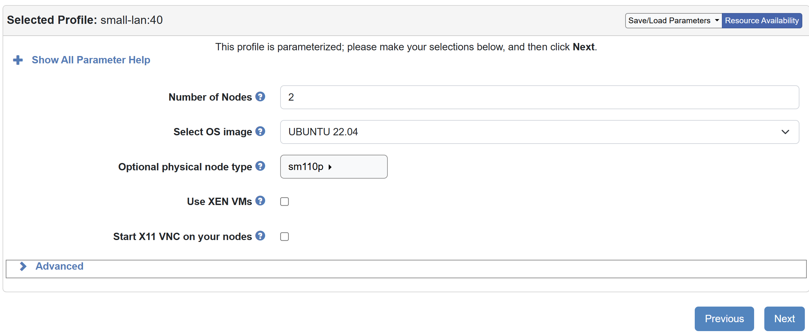

# Testbed

The testbed consists of 2 `sm110p` servers from [CloudLab](https://www.cloudlab.us/). 



| Component | Specification |
|-----------|--------------|
| **CPU** | One Intel Xeon Silver 4314 16-core CPU at 2.40 GHz |
| **RAM** | 128GB ECC DDR4-3200 Memory |
| **Disk 1** | One 960 GB Intel SATA 6G SSD (SSDSC2KG960G8) |
| **Disk 2** | Four 960 GB Samsung PCIe4 x4 NVMe (MZQL2960HCJR-00A07) |
| **NIC 1** | Dual-port Mellanox ConnectX-6 LX 25Gb NIC |
| **NIC 2** | Dual-port Mellanox ConnectX-6 DX 100Gb NIC|

## Update the Kernel Source
All nodes run Ubuntu 22.04 with kernel version 5.15.173.

```bash
sudo apt-get update
sudo apt-get install -y linux-source-5.15.0
cd /usr/src
sudo tar -xvf linux-source-5.15.0.tar.bz2
```

The kernel source code are modified according to the instructions in the [Kernel Patch](../kernel_patches/README.md) section. After making the modifications, we compile and install the new kernel on both nodes:

```bash
sudo apt-get install -y flex bison build-essential libncurses-dev libssl-dev libelf-dev bc dwarves
cd /usr/src/linux-source-5.15.0
# The original config file name may vary, please check the /boot directory
sudo cp /boot/config-5.15.0-131-generic .config 
sudo make -j31
sudo make modules_install
sudo make install
sudo reboot
```

## Installing Required Tools

### Install `fio`
We install fio version 3.36 as follows:
```
cd ~
wget https://brick.kernel.dk/snaps/fio-3.36.tar.gz
sudo apt-get update
sudo apt-get install build-essential libaio-dev zlib1g-dev
tar -xzvf fio-3.36.tar.gz
cd fio-3.36
./configure
make -j32
sudo make install
sudo fio -v
```

### Setting Up an NVMe-over-TCP Target

This section describes how to configure an NVMe-over-TCP target by compiling and loading the necessary kernel modules, creating an NVMe subsystem and namespace, and setting up a network port for NVMe/TCP communication.


**1. Compile and Load the nvmet-tcp Kernel Module**

Since we have modified the kernel source code, we need to recompile the kernel modules:
```shell
cd /usr/src/linux-source-5.15.0
sudo make modules SUBDIRS=drivers/nvme/target -j31
sudo insmod ./drivers/nvme/target/nvmet.ko
sudo insmod ./drivers/nvme/target/nvmet-tcp.ko
```

**2. Create the NVMe Subsystem and Namespace**
```shell
sudo mkdir -p /sys/kernel/config/nvmet/subsystems/subsystem1
sudo sh -c "echo 1 > /sys/kernel/config/nvmet/subsystems/subsystem1/attr_allow_any_host"
sudo mkdir -p /sys/kernel/config/nvmet/subsystems/subsystem1/namespaces/1
sudo sh -c "echo -n /dev/nvme0n1 > /sys/kernel/config/nvmet/subsystems/subsystem1/namespaces/1/device_path"
sudo sh -c "echo 1 > /sys/kernel/config/nvmet/subsystems/subsystem1/namespaces/1/enable"
```

**3. Create and Configure an NVMe-over-TCP Port**
```shell
sudo mkdir -p /sys/kernel/config/nvmet/ports/1
sudo sh -c "echo ipv4 > /sys/kernel/config/nvmet/ports/1/addr_adrfam"
# use ifconfig to check the IP address of the target node
sudo sh -c "echo 10.10.1.2 > /sys/kernel/config/nvmet/ports/1/addr_traddr"
sudo sh -c "echo tcp > /sys/kernel/config/nvmet/ports/1/addr_trtype"
sudo sh -c "echo 4420 > /sys/kernel/config/nvmet/ports/1/addr_trsvcid"
```

**4. Link the Subsystem to the Port**
```
sudo ln -s /sys/kernel/config/nvmet/subsystems/subsystem1 /sys/kernel/config/nvmet/ports/1/subsystems/subsystem1
```


### Setting Up an NVMe-over-TCP Initiator

**1. Install the nvme-cli Package (if not already installed)**
```shell
sudo apt install nvme-cli
```

**2. Unload Any Existing nvme-tcp Module (if loaded)**
```shell
sudo rmmod nvme_tcp
sudo rmmod nvme-fabrics
```

**3. Recompile the Kernel Modules**
```shell
cd /usr/src/linux-source-5.15.0
sudo make modules SUBDIRS=drivers/nvme/host -j31
sudo modprobe nvme-core
sudo insmod ./drivers/nvme/host/nvme-fabrics.ko
sudo insmod ./drivers/nvme/host/nvme-tcp.ko
```

**4. Connect to the NVMe-over-TCP Target**
```shell
sudo nvme connect -t tcp -n subsystem1 -a 10.10.1.2 -s 4420
```
After connecting to the target, you can verify the connection by running sudo nvme list. The remote NVMe device should appear as something like `/dev/nvme4n1`:
```shell
> sudo nvme list
Node                  SN                   Model                                    Namespace Usage                      Format           FW Rev  
--------------------- -------------------- ---------------------------------------- --------- -------------------------- ---------------- --------
/dev/nvme0n1          S64FNE0R906008       SAMSUNG MZQL2960HCJR-00A07               1          22.08  GB / 960.20  GB    512   B +  0 B   GDC5302Q
/dev/nvme1n1          S64FNE0RA02592       SAMSUNG MZQL2960HCJR-00A07               1           7.57  GB / 960.20  GB    512   B +  0 B   GDC5302Q
/dev/nvme2n1          S64FNE0RA03068       SAMSUNG MZQL2960HCJR-00A07               1           7.65  GB / 960.20  GB    512   B +  0 B   GDC5302Q
/dev/nvme3n1          S64FNE0RA03066       SAMSUNG MZQL2960HCJR-00A07               1           8.66  GB / 960.20  GB    512   B +  0 B   GDC5302Q
/dev/nvme4n1          a5ac4cae45bdc3c0b595 Linux                                    1         960.20  GB / 960.20  GB    512   B +  0 B   5.15.173
```

**5. Installing the `iniparser` Library**

The ntprof tool requires the `iniparser` library to parse configuration files. You can install it using:
```shell
sudo apt isntall libiniparser-dev
```